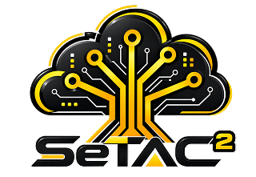

<div align="center">



# Setac² 2026

**Site da XIII Semana Tecnológica Acadêmica de Ciência da Computação**<br>
UTFPR Santa Helena · 05 e 06 de outubro de 2026


</div>

---

Projeto de faculdade feito por alunos de Ciência da Computação da UTFPR Santa Helena para a
Setac², a semana acadêmica do curso. O site apresenta o evento, mostra a programação, as
palestras, os minicursos e quem vai falar, e leva o aluno para a inscrição de cada atividade
(Google Forms).

A ideia: o site é um **desktop do Windows 98 com cara de internet de 1998**. Fundo verde-azulado,
janelas cinza em relevo, ícones de pixel, barra de tarefas, menu Iniciar e os enfeites da web
antiga, como o marquee.

## O que tem

- **Um "sistema operacional" no PC.** Na tela inicial, ícones, menu Iniciar e links abrem janelas
  pop-up que arrastam, minimizam, maximizam e fecham, cada uma com seu botão na barra de tarefas.
  Tudo cabe em uma tela, sem rolagem.
- **Páginas normais no celular.** No toque o site vira páginas empilhadas, com alvos de 44px e o
  menu Iniciar como navegação.
- **Hero em prompt de comando.** A logo em ASCII, as informações do evento no estilo neofetch e
  uma contagem regressiva no prompt.
- **Programação ao vivo.** Abas por dia; durante o evento, a atividade em andamento ganha o selo
  AGORA.
- **Inscrição por atividade.** Cada palestra e minicurso tem seu link do Google Forms, configurado
  em um arquivo só.
- **Tudo estático.** As páginas são geradas no build, com metadata e imagem de compartilhamento
  próprias, e cada atividade tem sua URL (`/palestras/erasmus`, `/minicursos/aws`...).
- **Lixeira no desktop**, com os arquivos que todo aluno de Computação já apagou. Não tente
  esvaziar.
- **404 em tela azul**, claro.

## Rodando

Precisa do Node 20.9 ou mais novo.

```bash
git clone https://github.com/GUSTAVOHOOO/setac2-2026.git
cd setac2-2026
npm install
npm run dev
```

Abra http://localhost:3000.

| Script              | O que faz                                             |
| ------------------- | ----------------------------------------------------- |
| `npm run dev`       | Servidor de desenvolvimento                           |
| `npm run build`     | Build de produção (todas as páginas estáticas)        |
| `npm run start`     | Sobe o build de produção                              |
| `npm run lint`      | ESLint (`lint:fix` corrige o que der)                 |
| `npm run format`    | Prettier em tudo (`format:check` só confere)          |
| `npm run typecheck` | Gera os tipos das rotas (`next typegen`) e roda `tsc` |

## Editando o conteúdo

### Links de inscrição

Tudo em **`src/data/inscricoes.ts`**. Troque o `undefined` pelo link do formulário:

```ts
export const INSCRICOES: Record<PalestraId, string | undefined> = {
  'direito-digital': 'https://forms.gle/XXXXXXXX',
  aws: 'https://forms.gle/YYYYYYYY',
  // ...
};
```

Com link, o card mostra **Inscrever-se** (abre em nova aba); sem link, mostra
**Inscrições em breve**. Só links `https://` valem, e atividade marcada `aDefinir: true` fica
"em breve" mesmo com link.

### Dados do evento

Tudo em `src/data/`, e o site inteiro acompanha:

| Arquivo           | O que tem                                                                               |
| ----------------- | --------------------------------------------------------------------------------------- |
| `programacao.ts`  | Programação por dia e `INICIO_EVENTO` (alvo da contagem regressiva)                     |
| `palestras.ts`    | Palestras e minicursos: título, resumo, data, horário, local, palestrantes              |
| `palestrantes.ts` | Nome, mini bio e foto (`public/palestrantes/<id>.jpg`, retrato 4:5; sem foto, iniciais) |
| `types.ts`        | Tipos e a lista `PALESTRA_IDS`                                                          |
| `logo-ascii.ts`   | A logo em ASCII do prompt da hero                                                       |
| `lixeira.ts`      | Os arquivos zoados da Lixeira (cada um abre no Bloco de Notas)                          |

**Atividade nova:** adicione o id em `PALESTRA_IDS`, a entrada em `palestras.ts` e o slot em
`inscricoes.ts` (o TypeScript avisa se faltar algum). A página dela é criada sozinha no build.

## Como o código está organizado

```
src/
  app/            rotas (App Router): /, /programacao, /palestras, /minicursos, /palestrantes, 404
  components/
    os/           o "sistema": janelas pop-up, barra de tarefas, qual link abre qual janela
    win98/        Window, Button, Taskbar, StartMenu, Tabs, ListView, Terminal...
    event/        Hero (CMD), Schedule, TalkCard, SpeakersWizard, InscricaoButton...
    web90s/       Marquee e enfeites da web antiga
  data/           dados do evento e links de inscrição
  hooks/          relógio, contagem regressiva, arrastar, modo PC/celular
  lib/            datas, helpers de dados, metadata, navegação
  styles/         tokens.css + bundle.css (design system) e site.css (layout do site)
public/           ícones em pixel art, logo e fotos dos palestrantes
```

O visual vem do design system da Setac² (classes `w98-*`, `web-*`, `sch-*`, `talk-*`, `spk-*` em
`src/styles/bundle.css`), sem Tailwind nem CSS-in-JS. As fontes Pixelify Sans e VT323 são
carregadas pelo `next/font`.

As janelas pop-up do PC estão em `src/components/os/`: `apps.tsx` diz qual rota vira qual janela
(e com que largura), e `OsProvider.tsx` cuida de abrir, focar, arrastar e minimizar. No celular o
mesmo link só navega para a página.

## Abertura Windows 98

Boot decorativo de 4,8 segundos: POST, passagem DOS, logo Windows 98 e entrada no desktop.
Aparece uma vez por sessão da aba, com **Pular abertura** e **Esc**; pular também registra a sessão.
Com movimento reduzido, o conteúdo abre diretamente. Não há áudio automático.

Depois do boot completo, o desktop se monta em aproximadamente 1,1 segundo com Anime.js:
barra de tarefas, ícones, contornos dos títulos e pintura das janelas. A sequência usa passos
discretos inspirados no Windows 98. Só ocorre após o término automático do splash; **Pular**
e **Esc** abrem tudo pronto. Qualquer interação durante a montagem termina o efeito, assim
como redimensionar a tela ou ativar movimento reduzido. Recarregar a mesma sessão não repete.
O efeito fica isolado em `src/components/boot/revealDesktop.ts`, sem alterar a posição ou o
arraste das janelas. [Referências da animação](docs/research/windows-98-desktop-animation.md).

A sequência fica em `src/components/boot/BootScreen.tsx`, o estilo em `src/styles/boot.css`
e a logo local em `public/boot/` (origem registrada no README dessa pasta). A logo Windows
é uma exceção ao design system solicitada pelo responsável pelo projeto.

Para rever na mesma aba, execute `sessionStorage.removeItem('setac2:boot-seen')` no console
do navegador e recarregue. Sem armazenamento disponível, o boot continua pulável, mas pode
repetir após recargas. Sem JavaScript, a página abre normalmente; se a hidratação falhar,
a proteção de carregamento libera o conteúdo em até 8 segundos.

Pesquisa e decisões: [inicialização Windows 98](docs/research/windows-98-boot.md).

## Deploy

Feito para a [Vercel](https://vercel.com): importe o repositório e pronto, sem configuração
extra. Com domínio próprio, defina `NEXT_PUBLIC_SITE_URL` (ex.: `https://setac.exemplo.com`)
para os links de compartilhamento saírem certos.

## Contribuindo

Achou um bug ou quer ajudar? Abra uma issue ou um pull request. Antes de mandar, rode
`npm run lint`, `npm run typecheck` e `npm run format`.

## Licença

O código está sob a licença [MIT](LICENSE). A logo e o nome Setac², as fotos dos palestrantes e
as informações do evento pertencem aos seus donos e não entram nessa licença.

Os ícones do site são pixel art original. A abertura usa a logo Windows 98, atribuída à Microsoft,
por solicitação do responsável pelo projeto; a origem está em [public/boot/README.md](public/boot/README.md).
Essa marca não faz parte da licença MIT do código.
